# Modelo de datos — diagrama de entidades

Diagrama conceptual de entidades y relaciones de la app de planes, derivado de la
sección "Modelo de datos: entidades y relaciones" de [`PRODUCTO.md`](../PRODUCTO.md).
No es el esquema final de base de datos: fija el vocabulario y las relaciones
principales. Los atributos se muestran abreviados (clave y campos representativos).

```mermaid
erDiagram
    USUARIO ||--o| CUENTA_EMPRESA : "puede ser"
    USUARIO ||--o| VERIFICACION_IDENTIDAD : tiene
    CUENTA_EMPRESA ||--o| VERIFICACION_NEGOCIO : tiene
    USUARIO ||--o{ SESION_DISPOSITIVO : usa
    USUARIO ||--o{ CONSENTIMIENTO : otorga

    USUARIO ||--o{ SEGUIMIENTO : "sigue a"
    USUARIO ||--o{ SEGUIMIENTO : "es seguido por"
    USUARIO ||--o{ BLOQUEO : "bloquea"
    USUARIO ||--o{ BLOQUEO : "es bloqueado por"

    CUENTA_EMPRESA ||--o{ LUGAR : posee
    LUGAR ||--o{ PLAN : hospeda
    USUARIO ||--o{ PLAN : "organiza (anfitrion)"
    CATEGORIA ||--o{ PLAN : clasifica

    PLAN ||--o{ INSCRIPCION : recibe
    USUARIO ||--o{ INSCRIPCION : realiza
    INSCRIPCION ||--o| PAGO : genera

    PLAN ||--o{ ASISTENCIA_REAL : "registra (geo)"
    USUARIO ||--o{ ASISTENCIA_REAL : asiste

    PLAN ||--o{ SOLICITUD_ASISTENCIA : recibe
    USUARIO ||--o{ SOLICITUD_ASISTENCIA : envia

    GRUPO ||--o{ MIEMBRO_GRUPO : tiene
    USUARIO ||--o{ MIEMBRO_GRUPO : "es miembro"
    GRUPO ||--o{ PLAN : organiza

    USUARIO ||--o{ PUBLICACION : crea

    PLAN ||--o{ RESENA : abre
    USUARIO ||--o{ RESENA : "escribe"
    USUARIO ||--o{ RESENA : "es resenado en"

    PLAN ||--o| AFTERMOVIE : "se convierte en"
    USUARIO ||--o{ AFTERMOVIE : publica
    USUARIO ||--o{ STORY : publica
    PLAN ||--o{ STORY : ambienta
    USUARIO ||--o{ MENCION : "es mencionado en"
    HASHTAG ||--o{ AFTERMOVIE : agrupa
    LUGAR ||--o{ HASHTAG : ancla

    PLAN ||--o| CONVERSACION : "tiene chat"
    CONVERSACION ||--o{ MENSAJE : contiene
    USUARIO ||--o{ MENSAJE : envia

    USUARIO ||--o{ CONTACTO_CONFIANZA : define
    USUARIO ||--o{ EVENTO_SEGURIDAD : dispara
    PLAN ||--o{ EVENTO_SEGURIDAD : "ocurre en"
    USUARIO ||--o{ REPORTE : emite
    REPORTE ||--o{ ACCION_MODERACION : "deriva en"

    CUENTA_EMPRESA ||--o{ SUSCRIPCION_NEGOCIO : contrata
    USUARIO ||--o{ CAMPANA_BOOST : anuncia
    PLAN ||--o| CAMPANA_BOOST : promociona
    USUARIO ||--o{ NOTIFICACION : recibe

    USUARIO {
        uuid id PK
        string tipo "particular | profesional"
        string usuario "handle unico"
        string email
        date fecha_nacimiento "gate 18+"
        bool perfil_publico
        string presencia_default "publica|privada"
        string modo_recepcion_dm "cerrado|bajo_solicitud|abierto"
        float reputacion_estrellas "agregada"
        int indice_fiabilidad "no-shows, agregado"
    }
    CUENTA_EMPRESA {
        uuid id PK
        uuid usuario_id FK
        string nombre_comercial
        string horario
        string direccion
        string web
        string enlace_reserva
        bool distintivo_negocio_verificado
    }
    VERIFICACION_IDENTIDAD {
        uuid id PK
        uuid usuario_id FK
        string proveedor
        string estado
        datetime fecha
    }
    VERIFICACION_NEGOCIO {
        uuid id PK
        uuid cuenta_empresa_id FK
        string prueba_titularidad
        string estado
    }
    SEGUIMIENTO {
        uuid id PK
        uuid seguidor_id FK
        uuid seguido_id FK
        string estado "activo|pendiente"
        datetime fecha
    }
    BLOQUEO {
        uuid id PK
        uuid bloqueador_id FK
        uuid bloqueado_id FK
        datetime fecha
    }
    LUGAR {
        uuid id PK
        string tipo "negocio|publico"
        string nombre
        point coordenadas
        string categoria
        string hashtag
        bool reclamado
        uuid propietario_id FK "cuenta_empresa, nullable"
    }
    PLAN {
        uuid id PK
        string tipo "social_gratuito|experiencia_pago"
        string tipo_inscripcion "apuntado|libre"
        string modo_aprobacion "automatica|manual"
        uuid grupo_id FK "grupo organizador, nullable"
        int nivel "1|2|3"
        uuid anfitrion_id FK
        uuid lugar_id FK
        bool ubicacion_oculta
        datetime fecha_hora
        string recurrencia "puntual|recurrente"
        int tamano_min
        int tamano_max
        decimal precio "nullable"
        decimal desvelo "solo especial/saturado no de pago"
        string politica_cancelacion "flexible|moderada|estricta"
        string estado "proximo|en_curso|pasado"
    }
    INSCRIPCION {
        uuid id PK
        uuid plan_id FK
        uuid usuario_id FK
        string estado "solicitada|aprobada|confirmada|lista_espera|cancelada|asistio|no_show"
        bool reconfirmado_dia
        uuid pago_id FK "nullable"
    }
    ASISTENCIA_REAL {
        uuid id PK
        uuid plan_id FK
        uuid usuario_id FK
        datetime fecha_hora
        string metodo "geolocalizacion"
        string visibilidad "publica|privada"
    }
    SOLICITUD_ASISTENCIA {
        uuid id PK
        uuid plan_id FK
        uuid usuario_id FK
        string estado "pendiente|aceptada|rechazada"
        string mensaje
        datetime fecha
    }
    GRUPO {
        uuid id PK
        string nombre
        string descripcion
        string media
        datetime fecha_creacion
    }
    MIEMBRO_GRUPO {
        uuid id PK
        uuid grupo_id FK
        uuid usuario_id FK
        string rol "admin|miembro"
        datetime fecha_alta
    }
    PUBLICACION {
        uuid id PK
        uuid autor_id FK
        string formato "foto|video|carrusel"
        string media "una o varias imagenes"
        string pie_texto
        int likes
        string visibilidad
    }
    PAGO {
        uuid id PK
        uuid inscripcion_id FK
        decimal importe
        decimal comision "15% en planes de pago"
        string tipo "reserva|desvelo|boost|suscripcion|cpa"
        string estado_escrow "retenido|liberado|reembolsado"
    }
    RESENA {
        uuid id PK
        uuid plan_id FK
        uuid autor_id FK
        uuid sujeto_id FK "anfitrion o asistente"
        int estrellas
        string texto
    }
    AFTERMOVIE {
        uuid id PK
        uuid plan_id FK
        uuid autor_id FK
        string media
        string visibilidad
    }
    STORY {
        uuid id PK
        uuid autor_id FK
        uuid plan_id FK "opcional"
        string visibilidad "publico|privado|mejores_amigos"
        datetime expira_at "24h"
    }
    MENCION {
        uuid id PK
        string contenido_tipo "plan|story|aftermovie"
        uuid contenido_id
        uuid usuario_mencionado_id FK
        string estado "pendiente|aceptada|rechazada"
    }
    CONVERSACION {
        uuid id PK
        string tipo "chat_plan|dm"
        uuid plan_id FK "si chat_plan"
    }
    MENSAJE {
        uuid id PK
        uuid conversacion_id FK
        uuid autor_id FK
        string estado "solicitud|aceptado"
        bool leido
    }
    REPORTE {
        uuid id PK
        uuid reportante_id FK "anonimo ante reportado"
        string objeto_tipo "plan|usuario|mensaje|contenido|evento"
        uuid objeto_id
        string categoria
        string gravedad
        string estado "cola|en_revision|resuelto|escalado"
    }
    ACCION_MODERACION {
        uuid id PK
        uuid reporte_id FK
        string tipo "aviso|retirada|reduccion_alcance|suspension|bloqueo|retirar_organizar|retener_escrow"
        bool apelable
    }
    CONTACTO_CONFIANZA {
        uuid id PK
        uuid usuario_id FK
        string contacto
        uuid plan_compartido_id FK "opcional"
    }
    EVENTO_SEGURIDAD {
        uuid id PK
        uuid usuario_id FK
        uuid plan_id FK
        string tipo "checkin|sos"
        point ubicacion
    }
    SUSCRIPCION_NEGOCIO {
        uuid id PK
        uuid cuenta_empresa_id FK
        string tarifa
        string estado
    }
    CAMPANA_BOOST {
        uuid id PK
        uuid anunciante_id FK
        string tipo "campana_marca|boost"
        uuid plan_promocionado_id FK "en boost"
        decimal presupuesto
    }
    CATEGORIA {
        uuid id PK
        string nombre
        string estado "activa|fusionada|jubilada"
    }
    CONSENTIMIENTO {
        uuid id PK
        uuid usuario_id FK
        string tipo "terminos|privacidad|edad|codigo_conducta|ubicacion|verificacion|pagos"
        string version
    }
    SESION_DISPOSITIVO {
        uuid id PK
        uuid usuario_id FK
        string dispositivo
        datetime ultima_actividad
    }
    NOTIFICACION {
        uuid id PK
        uuid usuario_id FK
        string tipo
        bool leida
    }
```

